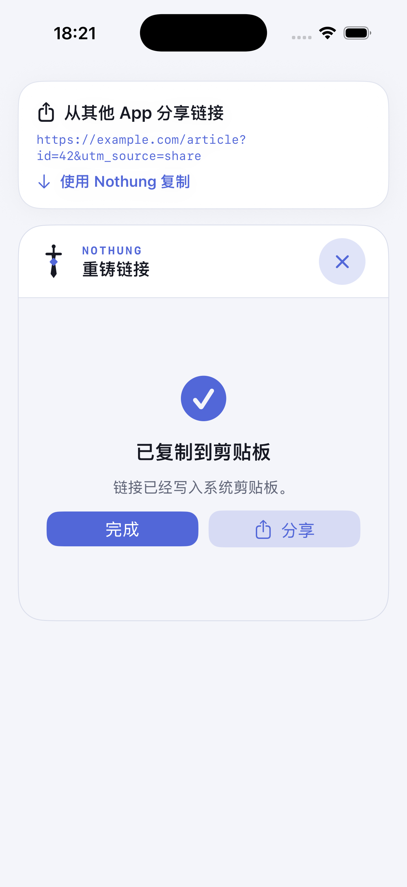
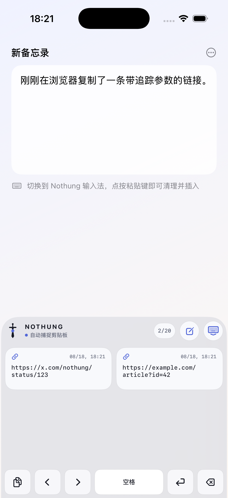
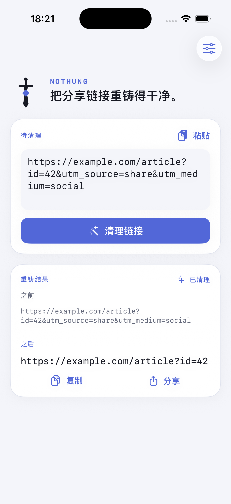

# Nothung

[English](README.md) | **简体中文**

Nothung 是一个本地优先的 iOS 分享链接清理工具，用于移除跟踪参数、按规则改写链接和展开短链。

本项目参考了 Android 应用 [Tarnhelm](https://github.com/lz233/Tarnhelm) 的公开功能，但 Swift 代码、界面和图标均为独立实现；Nothung 不是 Tarnhelm 官方移植版，也不隶属于 Tarnhelm。

## 三种主要使用方式

### 1. 使用“使用 Nothung 复制”

在 Safari 或其他 App 中打开链接的分享面板，选择**使用 Nothung 复制**。Nothung 会清理分享内容并把结果写入系统剪贴板；完成后可以直接关闭，也可以继续分享清理后的结果。

<p align="center">
  
</p>

### 2. 在外部复制后使用 Nothung 输入法粘贴

先在其他 App 中复制链接，再切换到 Nothung 输入法并点按粘贴键。Nothung 会清理当前剪贴板，并把结果插入正在编辑的文本框。开启完全访问后，输入法可见期间的新剪贴板内容也会自动清理并加入最近记录。

<p align="center">
  
</p>

### 3. 粘贴到 Nothung 清理

打开主 App，粘贴 URL 或包含链接的文本，然后点按**清理链接**。Nothung 会显示清理前后的内容，并在适用时列出移除的字段和命中的规则；结果可以继续复制或分享。

<p align="center">
  
</p>

## 其他功能

- 自定义参数、正则和重定向规则
- 快捷指令支持（URL 输入、URL 输出）
- 默认清理常见追踪参数、X/Twitter 和 Bilibili 分享链接
- 默认展开 `b23.tv`
- 在 Nothung 输入法中浏览最近的清理记录：轻点插入，长按查看原文
- 参数与正则清理在本地完成，不包含广告或分析 SDK
- 仅在 Nothung 输入法可见且获完全访问时监听剪贴板，不在后台运行

最低支持 iOS 17。

## 构建

```sh
open iOS/Nothung.xcodeproj
```

在 Xcode 中选择 `Nothung` Scheme 和自己的开发团队即可运行。其他开发者进行真机测试时，可能需要替换 `dev.nothung.*` Bundle ID 和 `group.dev.nothung.shared` App Group。

工程文件由 XcodeGen 2.46.0 生成；修改 `iOS/project.yml` 后运行：

```sh
xcodegen generate --spec iOS/project.yml
```

核心测试：

```sh
cd Packages/NothungCore
swift test
```

当前基线为 Xcode 26.6、iOS 26.5 SDK；45 项核心测试通过，另包含 40 项 iOS 集成/安全测试。

## 规则与许可证

Nothung 默认不包含 Tarnhelm 的完整规则库。可选转换包位于 [`RulePacks/Tarnhelm-GPL-3.0`](RulePacks/Tarnhelm-GPL-3.0)，由 [TarnhelmDocument](https://github.com/lz233/TarnhelmDocument) 规则转换而来，按 GPL-3.0-only 单独分发并由用户手动导入。

Nothung 自有代码目前未授予开源许可证，默认保留全部权利。详见 [许可证与来源说明](LICENSES.md) 和 [隐私政策](PRIVACY.md)。
